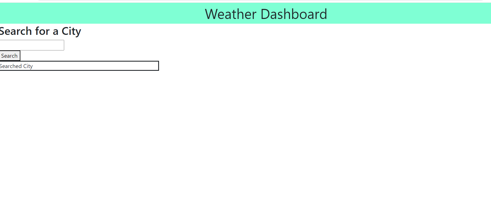

# Weather Dash

# Authors

Allen Klein

- [Link to Site]( https://allen-ek.github.io/day-planner/)
- [Link to Github Repository](https://github.com/allen-ek/day-planner)

## Why?
I wanted to create a Forecast webpage that would use api calls to retrive information and be able to use that data to generate elements onto the webpage. 

## What I learned
I lerned how to use thied party api's in conjuction with javascript and html to display the recived information and to format it in order to display 
the web project in my styling.
## Technologies Used
Bootstrap
Jquery
Open Weather api
CSS
HTML

## Code Snippet
```html
var requestURL="https://api.openweathermap.org/data/2.5/weather?q="+inputEl.value+"&appid=6cda419b1462d4e231cfcd1dac976851";
    fetch(requestURL)
        .then(function(response){
            
            return response.json();
        })
         .then(function(data){
```
The code snippet above was the code that allowed for retriving information through a fetch using a api key to retrive information from the Open Weather API.

